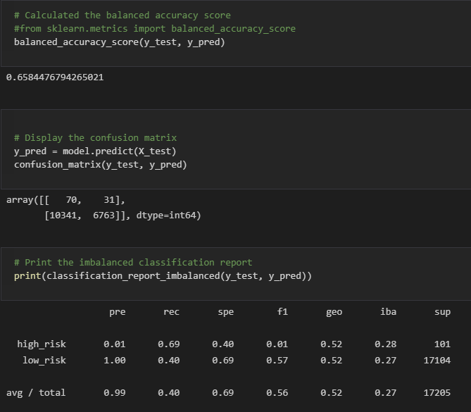

# Credit_Risk_Analysis
Module 17

## Overview of Analysis:

We are going to apply machine learning to solve the real world challenge of credit card risk.  Credit risk is an unbalanced classification problem as good loans easily outnumber risky loans.  We will employ different techniques to train and evaluate models with unbalanced classes using imbalanced-learn and scikit-learn libraries to build and evaluate the models with resampling.  We will oversample our data using RandomOverSampler and SMOTE algorithms and undersample the data with the ClusterCentroids algorithm.  Next we will use a combinatorial approach of over and undersampling using the SMOTEENN algorithm.  That will be followed by compare two machine learning models, BalancedRandomForestClassifier and EasyEnsembleClassifier, that reduce bias to predict credit risk.

## Resources:

Software:  
VS Code version 1.59
Python version 3.7.10
 
Code:  
[credit_risk_resampling.ipynb](Challenge/credit_risk_resampling.ipynb) 
[credit_risk_ensemble.ipynb](Challenge/credit_risk_ensemble.ipynb) 

Images: 
[Images](Challenge/Images/)  

Data: 
[LoanStats_2019Q1.csv](Challenge/Resources/LoanStats_2019Q1.csv) 

## Results:

Naive Random Oversampling
  

SMOTE Oversampling
  

Cluster Centroids
  

SMOTEENN
  

Balanced Random Forest Classifier
  

Easy Ensemble AdaBoost Classifier
  

## Summary:

