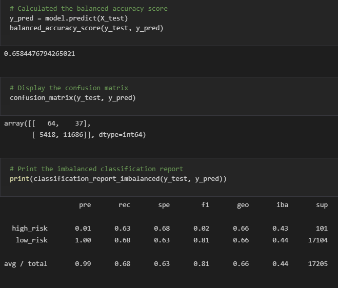
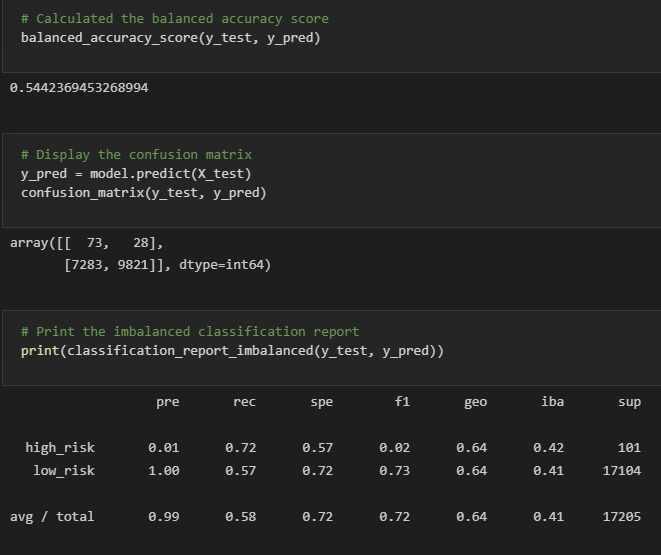

# Credit_Risk_Analysis
Module 17

## Overview of Analysis:

We are going to apply machine learning to solve the real world challenge of credit card risk.  Credit risk is an unbalanced classification problem as good loans easily outnumber risky loans.  We will employ different techniques to train and evaluate models with unbalanced classes using imbalanced-learn and scikit-learn libraries to build and evaluate the models with resampling.  We will oversample our data using RandomOverSampler and SMOTE algorithms and undersample the data with the ClusterCentroids algorithm.  Next we will use a combinatorial approach of over and undersampling using the SMOTEENN algorithm.  That will be followed by compare two machine learning models, BalancedRandomForestClassifier and EasyEnsembleClassifier, that reduce bias to predict credit risk.

## Resources:

Software:  
VS Code version 1.59 
Python version 3.7.10 
 
Code:  
[credit_risk_resampling.ipynb](Challenge/credit_risk_resampling.ipynb)  
[credit_risk_ensemble.ipynb](Challenge/credit_risk_ensemble.ipynb)  

Images: 
[Images](Challenge/Images/)  

Data: 
[LoanStats_2019Q1.csv](Challenge/Resources/LoanStats_2019Q1.csv)  

## Results:

Naive Random Oversampling  
  
- Balanced Accuracy Test is 64.9% 
- Precision Score average total is 99% 
- Recall Score average total is 40% 

SMOTE Oversampling  
  
- Balanced Accuracy Test is 65.8% 
- Precision Score average total is 99% 
- Recall Score average total is 68% 

Cluster Centroids  
  
- Balanced Accuracy Test is 65.8% 
- Precision Score average total is 99% 
- Recall Score average total is 40% 

SMOTEENN  
  
- Balanced Accuracy Test is 54.4% 
- Precision Score average total is 99% 
- Recall Score average total is 58% 

Balanced Random Forest Classifier  
  
- Balanced Accuracy Test is 74.7% 
- Precision Score average total is 99% 
- Recall Score average total is 88% 

Easy Ensemble AdaBoost Classifier  
  
- Balanced Accuracy Test is 93.1% 
- Precision Score average total is 99% 
- Recall Score average total is 94% 

## Summary:

We used oversampling in the first 2 models (Naive Random Oversampling and SMOTE Oversampling).  In the third model (Cluster Centroids) we used undersampling.  For the fourth model (SMOTEENN) we used a combination of over and undersampling.  This was to determine which model is best to predict which loans are the highest risk.

In the fifth and sixth models (Balanced Random Forest Classifier and East Ensemble AdaBoost Classifier) we used classifiers to predict which loans are high risk and low risk.

With the first four models, the accuracy score is not as high as the classifiers and the recall in the oversampling, undersampling, and over/undersampling models is low. In the models we wanted a good balance of recall and precision which is why we recommend using the classifiers over the first four models.